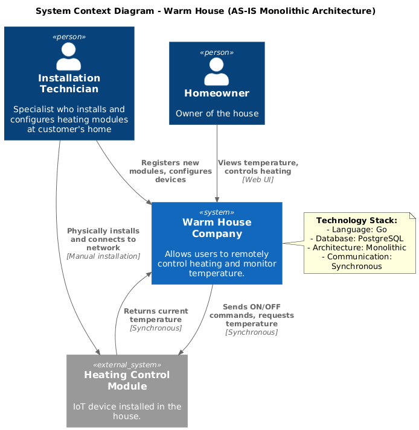
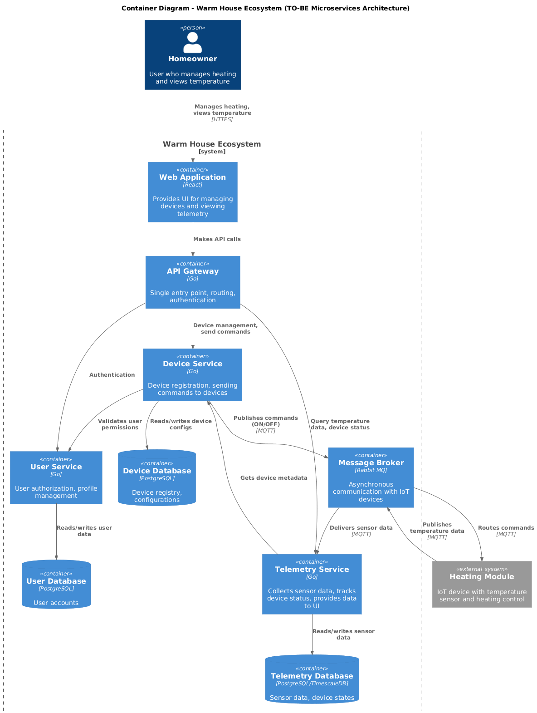
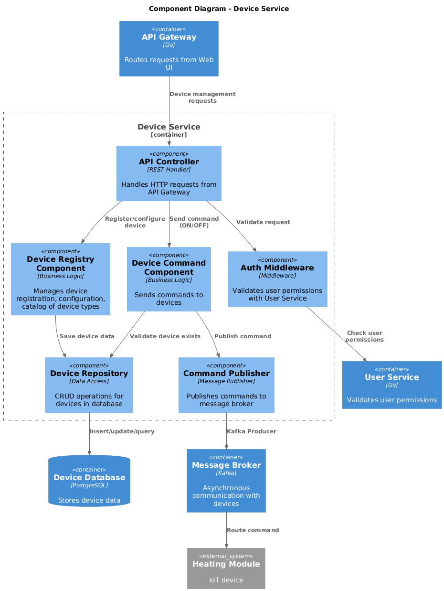
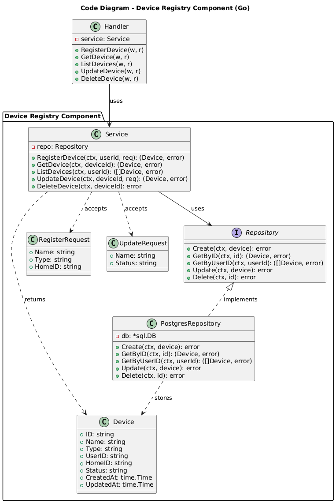
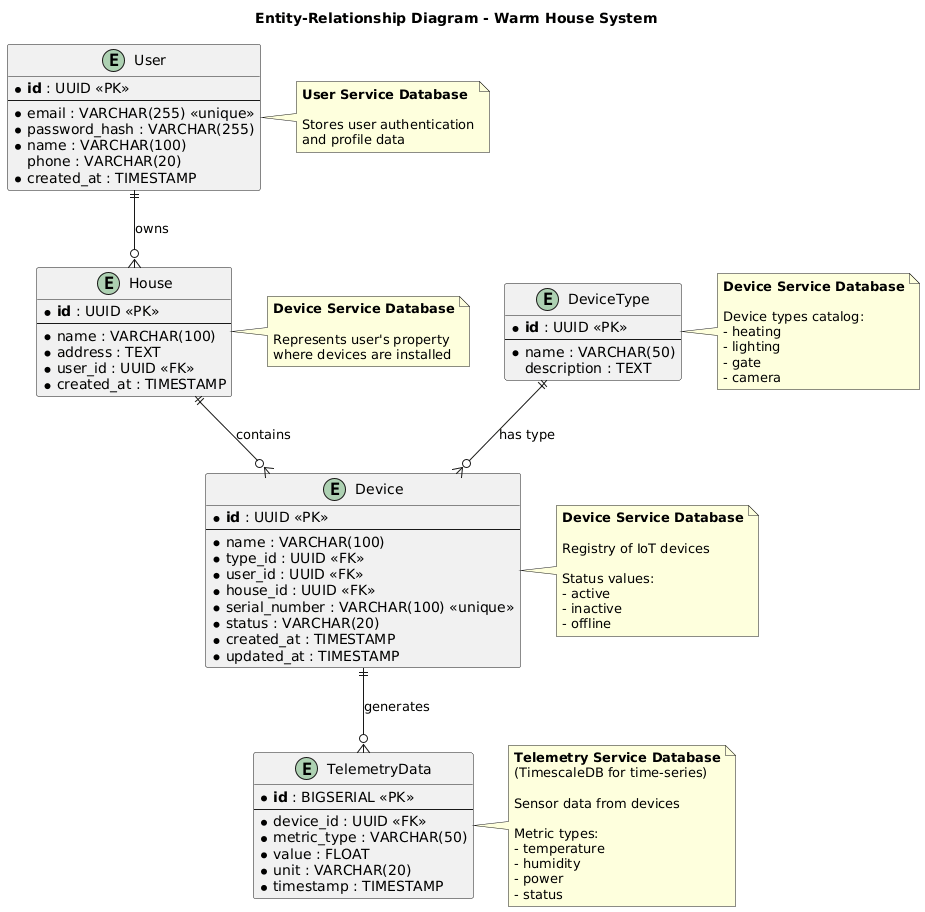

# Задание 1. Анализ и планирование

### 1. Описание функциональности монолитного приложения

**Управление отоплением:**

- Система поддерживает мануальное подключение новых устройств, с помощью выезда сотрудника на место.
- Пользователи могут управлять отоплением (включить/выключить).

**Мониторинг температуры:**

- Система собирает данные о температуре с помощью запросов от сервера к датчикам.
- Пользователи могут проверять температуру в домах через веб-интерфейс.

### 2. Анализ архитектуры монолитного приложения

- Язык программирования: Go
- База данных: PostgreSQL
- Архитектура: Монолитная, все компоненты системы (обработка запросов, бизнес-логика, работа с данными) находятся в рамках одного приложения.
- Взаимодействие: Синхронное, запросы обрабатываются последовательно.
- Масштабируемость: Ограничена, так как монолит сложно масштабировать по частям.
- Развертывание: Требует остановки всего приложения.

### 3. Определение доменов и границы контекстов

Управление пользователями:
- Авторизация в системе

Управление устройствами:
- Регистрация устройств в системе
- Управление отоплением

Телеметрия:
- Получение данных с датчиков
- Отправка данных на веб-интерфейс
- Отслеживание состояния устройств

### 4. Проблемы монолитного решения

- Сложность разработки и тестирования: Высокая связанность компонентов затрудняет разработку и повышает шанс возникновения ошибок.
- Сложность масштабирования: Невозможно масштабировать отдельные компоненты.
- Недоступность приложения: Требуется полная остановка для деплоя.

### 5. Визуализация контекста системы — диаграмма С4

# Задание 2. Проектирование микросервисной архитектуры

**Диаграмма контейнеров (Containers)**

**Диаграмма компонентов (Components)**

**Диаграмма кода (Code)**

# Задание 3. Разработка ER-диаграммы

# Задание 4. Создание и документирование API

### 1. Тип API

1. REST API будет использоваться для межсервисного взаимодействия. Так как клиенту нужен немедленный ответ, частые CRUD операции. Из плюсов, простая интеграция с фронтендом, стандартные HTTP методы, легко тестировать и отлаживать.
2. AsyncAPI будет использоваться для асинхронного взаимодействия между Device сервисом и датчиками, а так же для получения телеметрии от датчиков.

### 2. Документация API

[swagger](api/openapi.yaml)

# Задание 5. Работа с docker и docker-compose

Перейдите в apps.

Там находится приложение-монолит для работы с датчиками температуры. В README.md описано как запустить решение.

Вам нужно:

1) сделать простое приложение temperature-api на любом удобном для вас языке программирования, которое при запросе /temperature?location= будет отдавать рандомное значение температуры.

2) Приложение следует упаковать в Docker и добавить в docker-compose. Порт по умолчанию должен быть 8081

3) Кроме того для smart_home приложения требуется база данных - добавьте в docker-compose файл настройки для запуска postgres с указанием скрипта инициализации ./smart_home/init.sql

Для проверки можно использовать Postman коллекцию smarthome-api.postman_collection.json и вызвать:

- Create Sensor
- Get All Sensors

Должно при каждом вызове отображаться разное значение температуры

Ревьюер будет проверять точно так же.

+ DONE

# **Задание 6. Разработка MVP**

Необходимо создать новые микросервисы и обеспечить их интеграции с существующим монолитом для плавного перехода к микросервисной архитектуре. 

### **Что нужно сделать**

1. Создайте новые микросервисы для управления телеметрией и устройствами (с простейшей логикой), которые будут интегрированы с существующим монолитным приложением. Каждый микросервис на своем ООП языке.
2. Обеспечьте взаимодействие между микросервисами и монолитом (при желании с помощью брокера сообщений), чтобы постепенно перенести функциональность из монолита в микросервисы. 

В результате у вас должны быть созданы Dockerfiles и docker-compose для запуска микросервисов.

+ DONE
